# 🔗 PLANO DE INTEGRAÇÃO CHAT ↔ CRM - MELONCHAT

**Data:** 16/12/2025
**Objetivo:** Melhorar comunicação bidirecional entre módulos de Chat e CRM
**Status:** 📋 Planejamento

---

## 📊 VISÃO GERAL

O MelonChat possui dois módulos principais que precisam trabalhar em **sincronia total**:

```
┌─────────────────────────────────────────────────────┐
│                                                     │
│   ┌──────────────┐           ┌──────────────┐     │
│   │              │           │              │     │
│   │     CHAT     │ ←────────→│     CRM      │     │
│   │   (Inbox)    │  2-way    │  (Deals)     │     │
│   │              │  sync     │              │     │
│   └──────────────┘           └──────────────┘     │
│         ↓                           ↓              │
│   Conversations              Contacts/Deals        │
│   Messages                   Pipeline/Tasks        │
│   Agents                     Sales Team            │
│                                                     │
└─────────────────────────────────────────────────────┘
```

### Problemas Atuais

🔴 **Falta de Sincronização:**
- Conversa criada no chat não cria automaticamente um contato no CRM
- Deal criado no CRM não aparece no histórico do chat
- Mudança de status no CRM não reflete no chat (e vice-versa)

🔴 **Duplicação de Dados:**
- Informações do cliente armazenadas em locais diferentes
- Histórico fragmentado entre módulos
- Falta de "fonte única da verdade"

🔴 **Falta de Contexto:**
- Agente de chat não vê o stage do deal
- Vendedor CRM não vê as últimas mensagens
- Sem visão 360° do cliente

---

## 🎯 OBJETIVOS DA INTEGRAÇÃO

### 1. Sincronização Automática de Contatos

**Quando:** Sempre que uma nova conversa é iniciada no chat

```
FLUXO ATUAL (❌ Problema):
Novo contato no WhatsApp → Conversa criada → FIM
Cliente não aparece no CRM

FLUXO DESEJADO (✅ Solução):
Novo contato no WhatsApp → Conversa criada
                         ↓
                    Contact criado no CRM (auto)
                         ↓
                    Histórico sincronizado
```

### 2. Contexto CRM no Chat

**Quando:** Agente abre uma conversa

```
ATUAL (❌):
┌────────────────────────────┐
│ Chat Widget                │
│ ─────────────────────      │
│ João Silva                 │
│ Online                     │
│                            │
│ [Mensagens...]             │
│                            │
└────────────────────────────┘

DESEJADO (✅):
┌────────────────────────────┐
│ Chat Widget          📊 CRM │
│ ─────────────────────      │
│ João Silva                 │
│ 🏷️  Lead Quente            │
│ 💰 R$ 5.000 em negociação  │
│ 📅 Último contato: Ontem   │
│                            │
│ [Mensagens...]             │
│                            │
│ ├─ Criar Deal              │
│ ├─ Ver Histórico CRM       │
│ └─ Adicionar Tarefa        │
└────────────────────────────┘
```

### 3. Ações Rápidas CRM no Chat

**Quando:** Durante o atendimento

**Ações disponíveis:**
- ✅ Criar deal a partir da conversa
- ✅ Mover deal para próximo stage
- ✅ Agendar follow-up
- ✅ Adicionar tag ao contato
- ✅ Ver histórico de compras
- ✅ Enviar proposta comercial

### 4. Timeline Unificado

**Quando:** Visualizando histórico do cliente

```
📅 TIMELINE COMPLETA DO CLIENTE:

Hoje, 14:30
└─ 💬 Mensagem enviada: "Quanto custa o plano Pro?"
    (Chat)

Hoje, 10:00
└─ 📞 Ligação realizada: 15min
    (CRM - Atividade)

Ontem, 16:00
└─ 📄 Proposta enviada: R$ 5.000
    (CRM - Deal)

2 dias atrás
└─ 💬 Primeira mensagem: "Olá, gostaria de saber mais"
    (Chat)

3 dias atrás
└─ 🎯 Lead criado via formulário
    (CRM - Contact)
```

---

## 🛠️ IMPLEMENTAÇÃO TÉCNICA

### FASE 1: Sincronização Básica (Foundational)

#### 1.1 Trigger: Nova Conversa → Criar/Atualizar Contato

```sql
-- Migration: 20251217000010_chat_crm_sync_triggers.sql

-- Função para sincronizar contato quando conversa é criada
CREATE OR REPLACE FUNCTION sync_conversation_to_contact()
RETURNS TRIGGER AS $$
DECLARE
  v_contact_id UUID;
  v_contact_name TEXT;
  v_contact_phone TEXT;
BEGIN
  -- Extrair informações da conversa
  v_contact_name := NEW.contact_name;
  v_contact_phone := NEW.contact_number;

  -- Procurar contato existente pelo telefone
  SELECT id INTO v_contact_id
  FROM contacts
  WHERE company_id = NEW.company_id
    AND (phone = v_contact_phone OR whatsapp = v_contact_phone)
  LIMIT 1;

  -- Se não existe, criar novo contato
  IF v_contact_id IS NULL THEN
    INSERT INTO contacts (
      company_id,
      name,
      phone,
      whatsapp,
      source,
      created_from_conversation_id,
      created_at
    )
    VALUES (
      NEW.company_id,
      v_contact_name,
      v_contact_phone,
      v_contact_phone,
      'whatsapp', -- ou NEW.channel_type
      NEW.id,
      NOW()
    )
    RETURNING id INTO v_contact_id;

    RAISE NOTICE 'Novo contato criado: % (ID: %)', v_contact_name, v_contact_id;
  ELSE
    -- Atualizar última interação
    UPDATE contacts
    SET
      last_interaction_at = NOW(),
      last_interaction_type = 'chat',
      updated_at = NOW()
    WHERE id = v_contact_id;

    RAISE NOTICE 'Contato atualizado: % (ID: %)', v_contact_name, v_contact_id;
  END IF;

  -- Vincular conversa ao contato
  UPDATE conversations
  SET contact_id = v_contact_id
  WHERE id = NEW.id;

  RETURN NEW;
END;
$$ LANGUAGE plpgsql SECURITY DEFINER;

-- Trigger: executar APÓS inserção de conversa
DROP TRIGGER IF EXISTS trigger_sync_conversation_to_contact ON conversations;
CREATE TRIGGER trigger_sync_conversation_to_contact
  AFTER INSERT ON conversations
  FOR EACH ROW
  EXECUTE FUNCTION sync_conversation_to_contact();
```

#### 1.2 Função: Criar Deal a partir de Conversa

```sql
-- Função para criar deal direto do chat
CREATE OR REPLACE FUNCTION create_deal_from_conversation(
  p_conversation_id UUID,
  p_deal_title TEXT,
  p_deal_value DECIMAL(12,2) DEFAULT NULL,
  p_pipeline_id UUID DEFAULT NULL,
  p_notes TEXT DEFAULT NULL
)
RETURNS UUID AS $$
DECLARE
  v_company_id UUID;
  v_contact_id UUID;
  v_deal_id UUID;
  v_pipeline_id UUID;
  v_first_stage_id UUID;
BEGIN
  -- Obter informações da conversa
  SELECT company_id, contact_id
  INTO v_company_id, v_contact_id
  FROM conversations
  WHERE id = p_conversation_id;

  IF v_contact_id IS NULL THEN
    RAISE EXCEPTION 'Conversa não está vinculada a um contato';
  END IF;

  -- Obter pipeline padrão se não especificado
  IF p_pipeline_id IS NULL THEN
    SELECT id INTO v_pipeline_id
    FROM pipelines
    WHERE company_id = v_company_id
      AND is_default = TRUE
    LIMIT 1;
  ELSE
    v_pipeline_id := p_pipeline_id;
  END IF;

  -- Obter primeiro stage do pipeline
  SELECT id INTO v_first_stage_id
  FROM pipeline_stages
  WHERE pipeline_id = v_pipeline_id
  ORDER BY order_index ASC
  LIMIT 1;

  -- Criar o deal
  INSERT INTO deals (
    company_id,
    contact_id,
    pipeline_id,
    stage_id,
    title,
    value,
    notes,
    source,
    created_from_conversation_id,
    created_at
  )
  VALUES (
    v_company_id,
    v_contact_id,
    v_pipeline_id,
    v_first_stage_id,
    p_deal_title,
    p_deal_value,
    p_notes,
    'chat',
    p_conversation_id,
    NOW()
  )
  RETURNING id INTO v_deal_id;

  -- Adicionar atividade no CRM
  INSERT INTO activities (
    company_id,
    contact_id,
    deal_id,
    type,
    title,
    description,
    created_at
  )
  VALUES (
    v_company_id,
    v_contact_id,
    v_deal_id,
    'deal_created',
    'Deal criado via Chat',
    format('Deal "%s" criado durante conversa de chat', p_deal_title),
    NOW()
  );

  RETURN v_deal_id;
END;
$$ LANGUAGE plpgsql SECURITY DEFINER;

-- Grant para usuários autenticados
GRANT EXECUTE ON FUNCTION create_deal_from_conversation(UUID, TEXT, DECIMAL, UUID, TEXT) TO authenticated;
```

---

### FASE 2: Contexto CRM no Chat (UI Enhancement)

#### 2.1 Hook: useContactCRMData

```typescript
// src/hooks/crm/useContactCRMData.ts
import { useQuery } from '@tanstack/react-query';
import { supabase } from '@/lib/supabase';

export interface ContactCRMData {
  contact: {
    id: string;
    name: string;
    email?: string;
    phone?: string;
    tags: string[];
    lifecycle_stage: 'lead' | 'prospect' | 'customer' | 'inactive';
  };
  deals: {
    id: string;
    title: string;
    value: number;
    stage: string;
    probability: number;
  }[];
  activities: {
    id: string;
    type: string;
    title: string;
    created_at: string;
  }[];
  metrics: {
    total_conversations: number;
    total_purchases: number;
    lifetime_value: number;
    last_interaction_at: string;
  };
}

export function useContactCRMData(conversationId: string) {
  return useQuery({
    queryKey: ['contact-crm-data', conversationId],
    queryFn: async () => {
      // 1. Obter contact_id da conversa
      const { data: conversation } = await supabase
        .from('conversations')
        .select('contact_id, company_id')
        .eq('id', conversationId)
        .single();

      if (!conversation?.contact_id) {
        return null;
      }

      // 2. Buscar dados do contato
      const { data: contact } = await supabase
        .from('contacts')
        .select(`
          id,
          name,
          email,
          phone,
          tags,
          lifecycle_stage,
          last_interaction_at
        `)
        .eq('id', conversation.contact_id)
        .single();

      // 3. Buscar deals ativos
      const { data: deals } = await supabase
        .from('deals')
        .select(`
          id,
          title,
          value,
          stage:pipeline_stages(name),
          probability_default
        `)
        .eq('contact_id', conversation.contact_id)
        .not('status', 'in', '(won,lost)')
        .order('created_at', { ascending: false })
        .limit(5);

      // 4. Buscar últimas atividades
      const { data: activities } = await supabase
        .from('activities')
        .select('id, type, title, created_at')
        .eq('contact_id', conversation.contact_id)
        .order('created_at', { ascending: false })
        .limit(10);

      // 5. Calcular métricas
      const { data: metrics } = await supabase.rpc(
        'get_contact_metrics',
        { p_contact_id: conversation.contact_id }
      );

      return {
        contact,
        deals: deals || [],
        activities: activities || [],
        metrics: metrics || {
          total_conversations: 0,
          total_purchases: 0,
          lifetime_value: 0,
          last_interaction_at: contact?.last_interaction_at
        }
      } as ContactCRMData;
    },
    enabled: !!conversationId,
    staleTime: 30000, // 30 segundos
  });
}
```

#### 2.2 Componente: CRM Sidebar no Chat

```typescript
// src/components/chat/CRMSidebar.tsx
import { useContactCRMData } from '@/hooks/crm/useContactCRMData';
import { Badge } from '@/components/ui/badge';
import { Button } from '@/components/ui/button';
import { DollarSign, Tag, Activity, Plus } from 'lucide-react';

interface CRMSidebarProps {
  conversationId: string;
  onCreateDeal: () => void;
}

export function CRMSidebar({ conversationId, onCreateDeal }: CRMSidebarProps) {
  const { data: crmData, isLoading } = useContactCRMData(conversationId);

  if (isLoading) {
    return <div>Carregando informações do CRM...</div>;
  }

  if (!crmData) {
    return (
      <div className="p-4 text-center">
        <p className="text-muted-foreground mb-4">
          Nenhum contato vinculado
        </p>
        <Button onClick={onCreateDeal} variant="outline" size="sm">
          <Plus className="w-4 h-4 mr-2" />
          Criar Contato
        </Button>
      </div>
    );
  }

  const { contact, deals, activities, metrics } = crmData;

  return (
    <div className="w-80 border-l bg-background p-4 space-y-6">
      {/* Header do Contato */}
      <div>
        <div className="flex items-center justify-between mb-2">
          <h3 className="font-semibold text-lg">{contact.name}</h3>
          <Badge variant={
            contact.lifecycle_stage === 'customer' ? 'default' :
            contact.lifecycle_stage === 'prospect' ? 'secondary' :
            'outline'
          }>
            {contact.lifecycle_stage}
          </Badge>
        </div>
        {contact.email && (
          <p className="text-sm text-muted-foreground">{contact.email}</p>
        )}
      </div>

      {/* Métricas Rápidas */}
      <div className="grid grid-cols-2 gap-3">
        <div className="bg-muted rounded-lg p-3">
          <div className="flex items-center gap-2 mb-1">
            <DollarSign className="w-4 h-4 text-green-600" />
            <span className="text-xs font-medium">LTV</span>
          </div>
          <p className="text-lg font-bold">
            R$ {metrics.lifetime_value.toLocaleString('pt-BR')}
          </p>
        </div>
        <div className="bg-muted rounded-lg p-3">
          <div className="flex items-center gap-2 mb-1">
            <Activity className="w-4 h-4 text-blue-600" />
            <span className="text-xs font-medium">Conversas</span>
          </div>
          <p className="text-lg font-bold">
            {metrics.total_conversations}
          </p>
        </div>
      </div>

      {/* Deals Ativos */}
      <div>
        <div className="flex items-center justify-between mb-3">
          <h4 className="font-medium">Negociações</h4>
          <Button onClick={onCreateDeal} variant="ghost" size="sm">
            <Plus className="w-4 h-4" />
          </Button>
        </div>
        {deals.length === 0 ? (
          <p className="text-sm text-muted-foreground text-center py-4">
            Nenhuma negociação ativa
          </p>
        ) : (
          <div className="space-y-2">
            {deals.map(deal => (
              <div
                key={deal.id}
                className="bg-muted rounded-lg p-3 hover:bg-muted/80 cursor-pointer transition"
              >
                <p className="font-medium text-sm mb-1">{deal.title}</p>
                <div className="flex items-center justify-between">
                  <span className="text-xs text-muted-foreground">
                    {deal.stage.name}
                  </span>
                  <span className="text-sm font-bold text-green-600">
                    R$ {deal.value.toLocaleString('pt-BR')}
                  </span>
                </div>
              </div>
            ))}
          </div>
        )}
      </div>

      {/* Tags */}
      {contact.tags && contact.tags.length > 0 && (
        <div>
          <h4 className="font-medium mb-2">Tags</h4>
          <div className="flex flex-wrap gap-2">
            {contact.tags.map(tag => (
              <Badge key={tag} variant="secondary" className="text-xs">
                <Tag className="w-3 h-3 mr-1" />
                {tag}
              </Badge>
            ))}
          </div>
        </div>
      )}

      {/* Timeline de Atividades */}
      <div>
        <h4 className="font-medium mb-3">Histórico</h4>
        <div className="space-y-3">
          {activities.slice(0, 5).map(activity => (
            <div key={activity.id} className="flex gap-3">
              <div className="w-2 h-2 rounded-full bg-primary mt-1.5" />
              <div className="flex-1">
                <p className="text-sm font-medium">{activity.title}</p>
                <p className="text-xs text-muted-foreground">
                  {new Date(activity.created_at).toLocaleDateString('pt-BR')}
                </p>
              </div>
            </div>
          ))}
        </div>
      </div>

      {/* Ações Rápidas */}
      <div className="space-y-2 pt-4 border-t">
        <Button variant="outline" size="sm" className="w-full">
          Ver Histórico Completo
        </Button>
        <Button variant="outline" size="sm" className="w-full">
          Agendar Follow-up
        </Button>
        <Button variant="outline" size="sm" className="w-full">
          Enviar Proposta
        </Button>
      </div>
    </div>
  );
}
```

---

### FASE 3: Ações Bidirecionais (Advanced)

#### 3.1 Webhook: Deal Atualizado → Notificar Chat

```sql
-- Função para notificar chat quando deal muda de stage
CREATE OR REPLACE FUNCTION notify_chat_on_deal_update()
RETURNS TRIGGER AS $$
DECLARE
  v_contact_id UUID;
  v_conversation_id UUID;
  v_agent_message TEXT;
BEGIN
  -- Apenas notificar se stage mudou
  IF OLD.stage_id IS DISTINCT FROM NEW.stage_id THEN
    v_contact_id := NEW.contact_id;

    -- Buscar última conversa ativa do contato
    SELECT id INTO v_conversation_id
    FROM conversations
    WHERE contact_id = v_contact_id
      AND status IN ('active', 'waiting')
    ORDER BY updated_at DESC
    LIMIT 1;

    -- Se houver conversa ativa, adicionar mensagem do sistema
    IF v_conversation_id IS NOT NULL THEN
      v_agent_message := format(
        '🎯 O negócio "%s" foi movido para "%s"',
        NEW.title,
        (SELECT name FROM pipeline_stages WHERE id = NEW.stage_id)
      );

      INSERT INTO messages (
        conversation_id,
        content,
        is_from_me,
        is_system_message,
        created_at
      )
      VALUES (
        v_conversation_id,
        v_agent_message,
        TRUE,
        TRUE,
        NOW()
      );

      -- Atualizar last_message na conversa
      UPDATE conversations
      SET
        last_message = v_agent_message,
        last_message_time = NOW()
      WHERE id = v_conversation_id;
    END IF;
  END IF;

  RETURN NEW;
END;
$$ LANGUAGE plpgsql SECURITY DEFINER;

DROP TRIGGER IF EXISTS trigger_notify_chat_on_deal_update ON deals;
CREATE TRIGGER trigger_notify_chat_on_deal_update
  AFTER UPDATE ON deals
  FOR EACH ROW
  EXECUTE FUNCTION notify_chat_on_deal_update();
```

#### 3.2 Função RPC: Criar Deal pelo Chat

```typescript
// src/lib/api/deals.ts
import { supabase } from '@/lib/supabase';

export interface CreateDealFromChatParams {
  conversationId: string;
  title: string;
  value?: number;
  pipelineId?: string;
  notes?: string;
}

export async function createDealFromChat({
  conversationId,
  title,
  value,
  pipelineId,
  notes
}: CreateDealFromChatParams) {
  const { data, error } = await supabase.rpc('create_deal_from_conversation', {
    p_conversation_id: conversationId,
    p_deal_title: title,
    p_deal_value: value,
    p_pipeline_id: pipelineId,
    p_notes: notes
  });

  if (error) {
    throw new Error(`Erro ao criar deal: ${error.message}`);
  }

  return data as string; // ID do deal criado
}
```

---

### FASE 4: Analytics Unificado (Insights)

#### 4.1 View Materializada: Métricas Chat + CRM

```sql
-- View com métricas combinadas de Chat e CRM
CREATE MATERIALIZED VIEW IF NOT EXISTS chat_crm_unified_metrics AS
SELECT
  c.id as contact_id,
  c.company_id,
  c.name as contact_name,
  c.lifecycle_stage,

  -- Métricas de Chat
  COUNT(DISTINCT conv.id) as total_conversations,
  COUNT(DISTINCT m.id) as total_messages,
  MAX(conv.created_at) as last_conversation_at,
  AVG(
    EXTRACT(EPOCH FROM (conv.first_response_at - conv.created_at)) / 60
  )::INTEGER as avg_first_response_minutes,

  -- Métricas de CRM
  COUNT(DISTINCT d.id) as total_deals,
  COUNT(DISTINCT d.id) FILTER (WHERE d.status = 'won') as won_deals,
  COUNT(DISTINCT d.id) FILTER (WHERE d.status = 'lost') as lost_deals,
  COALESCE(SUM(d.value) FILTER (WHERE d.status = 'won'), 0) as lifetime_value,
  COALESCE(AVG(d.value) FILTER (WHERE d.status = 'won'), 0) as avg_deal_size,

  -- Tempo médio para fechar deal após primeiro contato
  AVG(
    EXTRACT(EPOCH FROM (d.closed_at - conv.created_at)) / 86400
  )::INTEGER as avg_days_to_close,

  -- Engajamento
  CASE
    WHEN MAX(conv.created_at) > NOW() - INTERVAL '7 days' THEN 'hot'
    WHEN MAX(conv.created_at) > NOW() - INTERVAL '30 days' THEN 'warm'
    ELSE 'cold'
  END as engagement_level

FROM contacts c
LEFT JOIN conversations conv ON conv.contact_id = c.id
LEFT JOIN messages m ON m.conversation_id = conv.id
LEFT JOIN deals d ON d.contact_id = c.id
GROUP BY c.id, c.company_id, c.name, c.lifecycle_stage;

-- Índices
CREATE INDEX idx_chat_crm_metrics_company ON chat_crm_unified_metrics(company_id);
CREATE INDEX idx_chat_crm_metrics_engagement ON chat_crm_unified_metrics(engagement_level);

-- Função para refresh automático
CREATE OR REPLACE FUNCTION refresh_chat_crm_metrics()
RETURNS VOID AS $$
BEGIN
  REFRESH MATERIALIZED VIEW CONCURRENTLY chat_crm_unified_metrics;
END;
$$ LANGUAGE plpgsql;
```

---

## 📱 UI/UX MELHORIAS

### 1. Widget CRM Contextual no Chat

**Localização:** Sidebar direito do chat
**Componentes:**
- Badge de lifecycle stage (Lead, Prospect, Customer)
- Valor total em negociação
- Botão "Criar Deal"
- Timeline de atividades recentes
- Tags do contato

### 2. Quick Actions no Chat

**Atalhos de teclado:**
- `Ctrl + D` → Criar novo deal
- `Ctrl + T` → Adicionar tag
- `Ctrl + F` → Agendar follow-up
- `Ctrl + P` → Enviar proposta

### 3. Notificações Inteligentes

```typescript
// Exemplo: Notificar agente quando deal está prestes a expirar
if (deal.expected_close_date < addDays(new Date(), 3)) {
  notify({
    title: '⏰ Deal próximo do vencimento',
    description: `${deal.title} expira em ${formatDistance(deal.expected_close_date, new Date())}`,
    action: {
      label: 'Enviar mensagem',
      onClick: () => openChat(deal.contact_id)
    }
  });
}
```

### 4. Dashboard Unificado

**Novo painel:** "Visão 360° do Cliente"
- Histórico de conversas + Deals numa timeline única
- Gráfico de engajamento ao longo do tempo
- Previsão de churn baseada em atividade
- Recomendações de ação (IA)

---

## 🔄 FLUXOS DE TRABALHO INTEGRADOS

### Fluxo 1: Lead Qualificado via Chat → CRM

```mermaid
graph TD
    A[Novo contato no WhatsApp] --> B{Já é cliente?}
    B -->|Não| C[Criar Contact no CRM]
    B -->|Sim| D[Atualizar última interação]
    C --> E[Chatbot faz qualificação]
    E --> F{Lead qualificado?}
    F -->|Sim| G[Criar Deal automaticamente]
    F -->|Não| H[Adicionar tag 'cold_lead']
    G --> I[Notificar vendedor]
    I --> J[Vendedor entra no chat]
```



### Fluxo 2: Deal Vencido → Mensagem Automática

```mermaid
graph TD
    A[Deal marcado como 'Won'] --> B[Trigger de atualização]
    B --> C[Enviar mensagem no chat]
    C --> D[Mensagem: Parabéns pela compra!]
    D --> E[Adicionar tag 'customer']
    E --> F[Mover lifecycle_stage para 'customer']
    F --> G[Adicionar à campanha de onboarding]
```



### Fluxo 3: Sem Resposta há 3 dias → Criar Tarefa CRM

```mermaid
graph TD
    A[Última mensagem há 3+ dias] --> B[Função cron detecta]
    B --> C{Há deal ativo?}
    C -->|Sim| D[Criar tarefa: Follow-up urgente]
    C -->|Não| E[Adicionar tag 'inactive']
    D --> F[Notificar vendedor responsável]
```



---

## 📊 MÉTRICAS DE SUCESSO

Para medir o sucesso da integração, monitorar:

### KPIs de Integração
- ✅ % de conversas com contato vinculado (meta: >95%)
- ✅ Tempo médio para criar deal após primeira conversa (meta: <24h)
- ✅ % de deals criados via chat (meta: >40%)
- ✅ Taxa de conversão chat → deal (meta: >15%)

### KPIs de Negócio
- 📈 Aumento no LTV dos clientes que usam chat
- 📈 Redução no tempo de ciclo de venda
- 📈 Aumento na taxa de conversão geral
- 📈 Satisfação do cliente (CSAT)

### Queries de Monitoramento

```sql
-- % de conversas com contato vinculado
SELECT
  COUNT(*) FILTER (WHERE contact_id IS NOT NULL)::FLOAT /
  NULLIF(COUNT(*), 0) * 100 as pct_with_contact
FROM conversations
WHERE created_at > NOW() - INTERVAL '30 days';

-- Tempo médio para criar deal após conversa
SELECT
  AVG(
    EXTRACT(EPOCH FROM (d.created_at - c.created_at)) / 3600
  )::INTEGER as avg_hours_to_deal
FROM deals d
JOIN conversations c ON c.id = d.created_from_conversation_id
WHERE d.created_at > NOW() - INTERVAL '30 days';

-- Taxa de conversão chat → deal
SELECT
  COUNT(DISTINCT d.id)::FLOAT /
  NULLIF(COUNT(DISTINCT c.id), 0) * 100 as conversion_rate
FROM conversations c
LEFT JOIN contacts ct ON ct.id = c.contact_id
LEFT JOIN deals d ON d.contact_id = ct.id
WHERE c.created_at > NOW() - INTERVAL '30 days';
```

---

## 🚀 ROADMAP DE IMPLEMENTAÇÃO

### Sprint 1 (Semana 1-2): Foundation
- [ ] Criar triggers de sincronização (conversa → contato)
- [ ] Implementar função create_deal_from_conversation
- [ ] Adicionar coluna contact_id em conversations
- [ ] Testes unitários das funções SQL

### Sprint 2 (Semana 3-4): UI Básico
- [ ] Hook useContactCRMData
- [ ] Componente CRMSidebar
- [ ] Integração no chat principal
- [ ] Testes E2E

### Sprint 3 (Semana 5-6): Ações Avançadas
- [ ] Modal "Criar Deal" no chat
- [ ] Quick actions (tags, follow-up)
- [ ] Notificações bidirecionais
- [ ] Testes de integração

### Sprint 4 (Semana 7-8): Analytics
- [ ] View materializada chat_crm_unified_metrics
- [ ] Dashboard "Visão 360°"
- [ ] Relatórios de conversão
- [ ] Documentação final

---

## 📚 DOCUMENTAÇÃO ADICIONAL

### Para Desenvolvedores
- [API Reference: CRM Functions](./docs/api/crm-functions.md)
- [Webhook Events](./docs/webhooks/crm-events.md)
- [Database Schema: Chat-CRM Relations](./docs/schema/chat-crm.md)

### Para Usuários
- [Como criar um Deal a partir do Chat](./docs/user-guide/chat-to-deal.md)
- [Entendendo a Timeline do Cliente](./docs/user-guide/timeline.md)
- [Quick Actions no Chat](./docs/user-guide/quick-actions.md)

---

**Última Atualização:** 16/12/2025
**Status:** 📋 Pronto para implementação
**Owner:** Time de Produto + Engenharia
